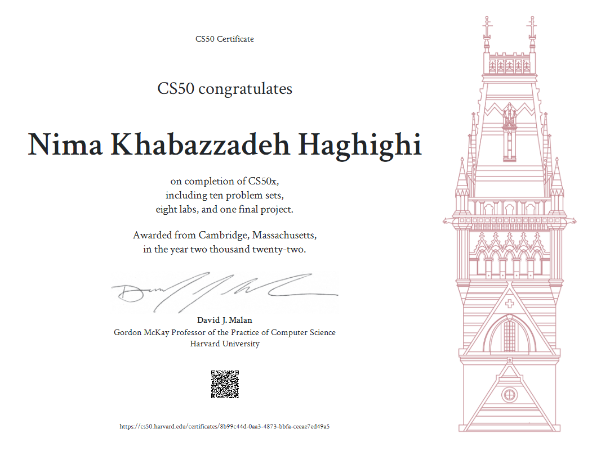

# How-to-get-cs50
in this repository, I will teach you how to get cs50 Harvard
<figure>
    
    <figcaption>Like this! and you can <a href="https://cs50.harvard.edu/certificates/8b99c44d-0aa3-4873-bbfa-ceeae7ed49a5">click here</a> to see my certificate</figcaption>
</figure>

## How can i get that:
for first you need to sing in `edx.org`.
and next go to<a href="https://www.edx.org/course/introduction-computer-science-harvardx-cs50x"> this link</a> when you see `enroll` click that
pay attention you don't need buy certificate edx beacuse Harvard is give you certificate too so you don't need edx. so you shold click `Access this course
` to continue.Congratulations you got the course!,and next you just see videos and answer the problem sets when you finish all of them you can request to get certificate.
